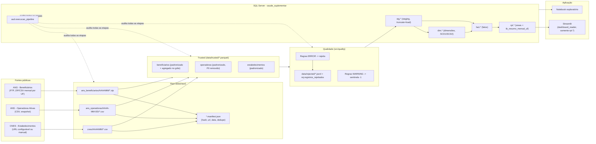
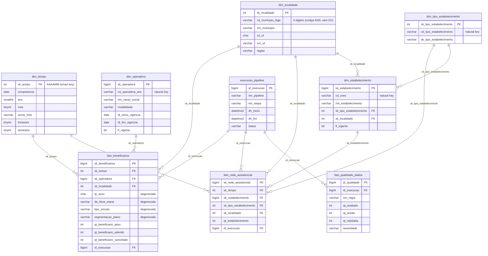
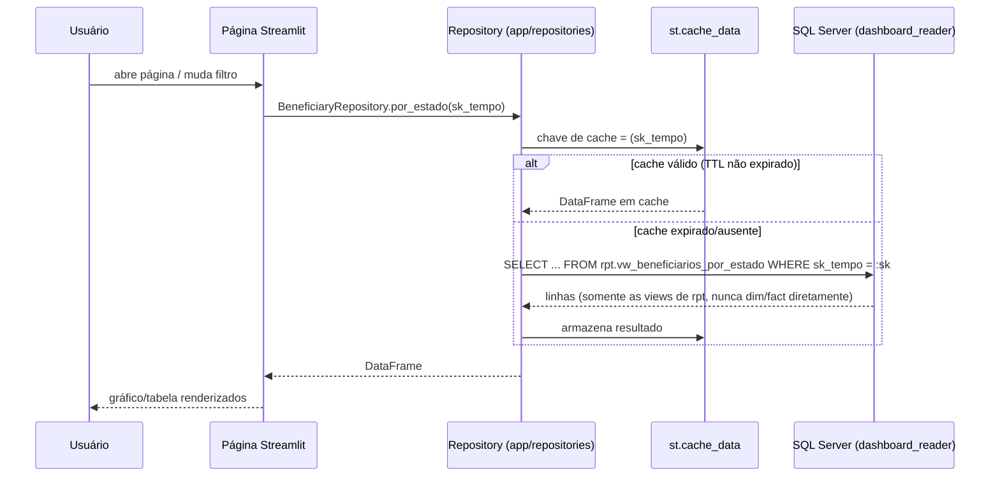

# Arquitetura

## Visão geral

## Etapas do pipeline (`python -m src.main --stage <etapa>`)

| Etapa | Responsabilidade | Módulo |
|---|---|---|
| `extract` | Baixa/registra arquivos brutos, calcula SHA-256, evita downloads duplicados | `src/extract/` |
| `validate_raw` | Confere integridade básica dos arquivos baixados (tamanho > 0, ZIP não corrompido) | `src/main.py::stage_validate_raw` |
| `transform` | Padroniza colunas/tipos, normaliza códigos, agrega no grão da fato, grava Parquet | `src/transform/` |
| `validate_trusted` | Aplica as regras de qualidade (`src/quality`), separa aceitos/rejeitados | `src/main.py::stage_validate_trusted` |
| `load` | Staging → upsert de dimensões (SCD1/SCD2) → upsert/MERGE de fatos, tudo transacional | `src/load/` |
| `aggregate` | Recalcula `rpt.tb_resumo_mensal_uf` (tabela materializada) | `src/services/aggregate.py` |
| `refresh_views` | Recria as 12 views analíticas (`CREATE OR ALTER VIEW`) | `src/services/views.py` |
| `export_analytics` | Exporta snapshots das views para Parquet em `data/analytics/` | `src/services/export_analytics.py` |

Cada etapa grava uma linha em `aud.execucao_pipeline` (início, fim, status, contadores, mensagens de erro) e pode ser executada isoladamente ou em sequência (`--stage all`).

## Camadas de dados

- **Raw**: cópia fiel do arquivo de origem + metadados de extração (URL, hash, tamanho, data, período). Nunca é reescrita; cada extração cria um novo arquivo/manifesto, e o mecanismo de deduplicação (mesma URL + arquivo já presente) evita baixar novamente sem necessidade.
- **Trusted**: um Parquet por dataset/competência, já com nomes de colunas padronizados (snake_case), tipos corrigidos e códigos normalizados. A agregação para o grão da fato acontece aqui (ver "Decisões de modelagem" abaixo).
- **Analytics/Gold**: vive dentro do SQL Server (schemas `dim`, `fact`, `rpt`), não em arquivo — exceto os snapshots opcionais gerados por `export_analytics` para consumo offline/notebook.

## Modelo dimensional

DDL completo em `sql/ddl/`; migrations equivalentes (executando os mesmos arquivos) em `alembic/versions/`.

## Decisões de modelagem (e por quê)

1. **`sk_tempo` é uma "smart key" (`AAAAMM` como inteiro), não um identity.** Todas as fontes publicam por competência mensal; usar o próprio inteiro `202412` como chave evita uma tabela de lookup extra e é imediatamente legível em depuração e nos parâmetros de CLI (`--reference-period 2024-12`).
2. **`cd_municipio_ibge` mantém o código de 6 dígitos exatamente como a ANS publica**, sem completar com zero à esquerda. O código da ANS já é o IBGE truncado (sem o dígito verificador) — preencher com zero à esquerda geraria um código diferente e inválido (`"140010"` viraria `"0140010"`, não o IBGE real `"1400100"`). Ver comentário em `src/transform/ans_beneficiarios.py`.
3. **`dim_operadora` e `dim_estabelecimento` são SCD Tipo 2** (histórico via `dt_inicio_vigencia`/`dt_fim_vigencia`/`fl_vigente`); **`dim_tempo`, `dim_localidade` e `dim_tipo_estabelecimento` são Tipo 1** (sobrescrevem) — não há necessidade de negócio para rastrear mudanças de nome de município ou tipo de estabelecimento.
4. **Sexo, faixa etária, tipo de vínculo e segmentação de plano são dimensões degeneradas** (atributos direto na fato), não mini-dimensões: são poucos valores distintos, estáveis, e não reutilizados por nenhuma outra fato — criar tabelas para eles só adicionaria joins sem ganho analítico.
5. **Linhas sentinela `-1`** em cada dimensão (`"Não identificado"`, `"Operadora não cadastrada"`, etc.) eliminam `NULL`s estruturais em joins, garantindo que toda linha de fato sempre encontre uma dimensão correspondente, mesmo com dado de origem incompleto.
6. **Agregação de grão acontece na Trusted, não na carga.** O arquivo bruto da ANS tem grão mais fino (inclui atributos de plano como `CD_PLANO` que não modelamos como dimensão); múltiplas linhas de origem podem legitimamente colapsar no grão da fato e precisam ser **somadas**, nunca tratadas como duplicata e descartadas (bug real encontrado e corrigido durante o desenvolvimento — ver commit/testes de `test_transform_ans_beneficiarios.py`).
7. **Re-agregação pós-resolução de chave substituta.** Como múltiplos códigos naturais distintos (operadoras não cadastradas, municípios "XX") podem colapsar no mesmo sentinela `-1`, a carga precisa agregar novamente **depois** de resolver `sk_operadora`/`sk_localidade`, ou o `INSERT` viola a constraint de grão da fato (outro caso real detectado via teste de integração).

## Carga: staging explícita vs. MERGE

A especificação pede para avaliar o uso do `MERGE` do SQL Server. Neste projeto:

- **`fact.fato_beneficiarios`** usa a estratégia **explícita** recomendada (staging → `UPDATE` dos existentes → `INSERT` dos novos → validação de contagem → commit → limpeza da staging), por ser mais previsível, mais fácil de testar isoladamente e de depurar em produção.
- **`fact.fato_rede_assistencial`** usa **`MERGE`** deliberadamente, como o caso avaliado. Grão `(sk_tempo, sk_estabelecimento)` — ambas chaves sempre `NOT NULL` — evita a armadilha mais comum do `MERGE` (comparação `NULL x NULL` na cláusula `ON` não bate, duplicando linhas silenciosamente). Limitações conhecidas e mitigação:
  - *"The MERGE statement attempted to UPDATE or DELETE the same row more than once"*: só ocorre se a origem tiver linhas duplicadas na chave de junção — mitigado pelo índice único filtrado `ux_dim_estabelecimento_vigente` (`cd_cnes` único entre as linhas vigentes).
  - MERGE não é necessariamente mais rápido que `UPDATE`+`INSERT` separados (mito comum) — usado aqui por motivo didático/arquitetural, não performance.
  - Testado em `tests/integration/test_load_facts.py` e `tests/integration/test_main_pipeline.py` (idempotência end-to-end).

Ambas as dimensões SCD2 (`dim_operadora`, `dim_estabelecimento`) usam `UPDATE` + `INSERT` explícitos (não `MERGE`), pela mesma preferência por previsibilidade.

## Fluxo Streamlit ↔ SQL Server

`dashboard_reader` só tem `GRANT SELECT` no schema `rpt` — nem consulta direta a `dim`/`fact`/`aud` é possível a partir da aplicação (testado em `tests/integration/test_views.py::test_dashboard_reader_can_select_from_views_but_not_from_facts`).

## Limitações conhecidas desta execução de demonstração

- Beneficiários carregados apenas para as UFs configuradas em `ANS_BENEFICIARIOS_UFS` (default: todas as 27 + `XX`; durante o desenvolvimento local foi usado um subconjunto RR/AC para velocidade).
- CNES usa um arquivo fictício de demonstração (`data/raw/cnes/incoming/exemplo_estabelecimentos_FICTICIO.csv`) até que um export real seja depositado — ver `docs/data_dictionary.md`.
- Sem geocodificação (latitude/longitude) — mapas coropléticos exigiriam uma base IBGE adicional fora do escopo definido.
